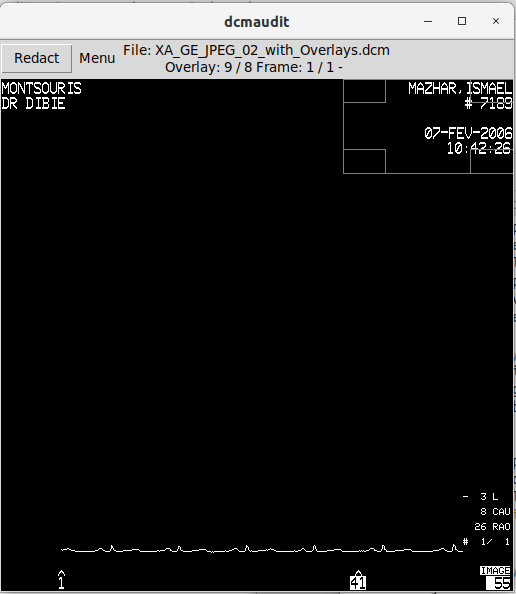

# DICOM Audit

## Introduction

The DICOM Audit tool helps to visualise all of the image frames contained
within a DICOM file to assist with finding text burned into the pixel data.
If particularly sensitive text is found it can be redacted, and the
coordinates of a redaction rectangle can be stored in a database.

One important feature of this tool is that it can display all of the frames
in a file, all of the overlays separately, and all of the frames of each overlay.
Some tools apply overlays onto an image frame, but this is not ideal.

There are already tools to do redaction but they are cumbersome to use,
and they often do not work on an individual frame level.

Note that only raster graphic overlays are supported.

## Installation

See requirements.txt, `pip install -r requirements.txt`

Note that on CentOS-7 the maximum version of pytesseract is 0.3.8
because after that it needs python 3.7 and Pillow 8. Ensure you are
installing into a python3 environment.

Ensure the `SMI_ROOT` variable is set so that the database can be
written to `$SMI_ROOT/data/dicompixelanon/` This directory can be
overridden with the `--db` option.

If necessary ensure the `TESSDATA_PREFIX` variable is set so that
Tesseract can find `tessdata/eng.traineddata`, for example
`TESSDATA_PREFIX=$SMI_ROOT/data/tessdata`

Also ensure that the `PATH` variable contains the path to the `tesseract`
program.  Try installing `tesseract-ocr` if not, or download from
https://github.com/second-state/OCR-tesseract-on-Centos7/raw/main/tesseract.tar.gz

If relying on redaction defined by rules then ensure the rules are
in `$SMI_ROOT/data/deid/`.

## Usage

Files to be redacted are specified on the command line:

```
usage: dcmaudit.py [-h] [-d] [-q] [--db dir] [--dump-database] [--review]
                   [-i [INFILES [INFILES ...]]]
optional arguments:
  -h, --help            show this help message and exit
  -d, --debug           debug
  -q, --quiet           quiet
  --db directory        database directory
  --dump-database       show database content in JSON format
  --review              review files already marked as done
  --tagged              only view files which have been tagged
  -i [INFILES [INFILES ...]] list of DICOM filenames, or a
     CSV filename to get the filenames from the DicomFilePath or filename column
```

A set of files can also be loaded by starting the program and using the
`File` menu to open:
* Files - select a set of DICOM files from
  - manually select one or more DICOM filenames
  - or a CSV file which contains a list of filenames in the DicomFilePath or filename column
  - or a database where the filenames are taken from both DicomRects and DicomTags tables
* Directory - select a directory which contains DICOM files
* Directory recursive - as above but looks for DICOM files in any subdirectory too

The `Options` menu can be used to refine which of the set of images is displayed.
The menu options mirror the `--review` and `--tagged` command line options,
to show all images including `done` ones, and to show only those which have been tagged
as needed further inspection. See below for details.

## Display of frame/overlay

Images have multiple frames, but then after all the frames come the overlays, and
each overlay can have multiple frames.
The overlay number is not shown until you have stepped through all the frames first.



## Marking rectangles for redaction

When the image is displayed it will automatically have rectangles redacted if
* the database contains rectangles for this filename
* the metadata tags match some deid rules
(see [dicom_redact](dicom_redact.md) and [deid rules](deidrules.md) documents)
* Ultrasound regions taken from tags in the DICOM file.
These redactions are controlled by options that can be changed in the menu.
Typically US regions are already redacted because of a rule in the deid
configuration so the separate US region option is not needed in this case.

Rectangles with a cross through them indicate possible redaction regions.
There are several types:
* those found for this filename in the database,
* those which match a similar file in the database,
* those which are derived from a rule in the deid configuration,
* those which are taken from Ultrasound Region tags in the DICOM file.
The display of these rectangles are controlled by options that can be changed in the menu.

A set of suggested rectangles may be displayed if the metadata matches
a similar file in the database, typically same Manufacturer, Model, and
image dimensions, because you've just edited one previously.

A rectangle with drag-corner boxes is displayed and can be dragged around the image.
If you drag from the middle of the rectangle it will stick inside the image.
When the rectangle covers the area where text might be found it can be
marked as such and the information stored in a database.

Note that rectangles apply to a specific frame (or overlay frame) in
an image. Different frames/overlays may have different rectangles.
A rectangle marked on an image frame does not automatically apply to
any overlays.

To ease the process of defining redaction rectangles, when an image is
displayed the database is queried to find other images with similar metadata.
If they have redaction rectangles then they are displayed on the current image
using a rectangle with a cross through it. These suggested rectangles can be
applied to the current image one at a time by right-clicking on the rectangle
or all at once use the 'A' key.

Redaction rectangles applied to the image will simply turn all
enclosed pixels black. If the background is already black you won't
see the rectangle of course. You can toggle the redaction using the
plus and minus keys. This is useful when displaying images which
already have rectangles in a database (maybe as a result of running
dicom_ocr) if you want to verify what was redacted.

## Marking whole files

Files can be tagged, meaning that this image needs further investigation.
The tag is stored in a database so all tagged images can be reviewed later.
Tags are shown as `[X]` before the filename.

Comments can be added to the database, one per image, and are displayed
alongside the frame/overlay number.

Files can be marked as "done" when they have been fully inspected.
When rectangles are marked they are saved instantly in the database, but
only when you explicitly mark the whole file as inspected will that
flag be saved.  This allows you to come back later and review a file
at any point until it is marked "done" after which it will not longer be
shown (unless you are explicitly reviewing all the "done" files).
Once a file has been marked as done then it won't be shown again
unless the `--review` option is used or chosen in the menu.

It should be noted that tagging or commenting on an image implicitly
marks it as "done" because files can be in these states in the database:
* having rectangles defined (in the DicomRects table) only means that
some rectangles have been defined but the file may still need more review
* having an entry in the DicomTags table which is tagged/marked
means that the file explicitly needs further review
* having an entry in the DicomTags table which is unmarked (not tagged)
means that the file has been fully reviewed (marked as "done")

Only files marked as done should be considered when making use of
the redaction rectangles. Likewise only rectangles from images marked
as done will be suggested as possible rectangles as the metadata
for comparison is not written until images are marked as "done".

## Keyboard shortcuts

```
? - show help dialogue
n - move to Next frame (or Next overlay frame)
p - move to Previous frame (or Previous overlay frame)
f - Fast-forward to next overlay (skip rest of current overlay frames)
N - mark the current image as 'done' in the database then move to the Next image
Esc - move to next image, do not mark current image as done
P - move to the previous image, do not mark current image as done
i - Display some DICOM tag information
o - Display the result of running OCR on the image
Minus - Display without redaction
Plus - Display with redaction
r - redact the image within the rectangle and store this rectangle in the database
A - apply all suggested rectangles to the current frame
t - tag this image as needing further investigation and store the tag in the database.
c - add a comment about this file to the database.
q - quit
```
N.B. if you quit, but haven't marked done with N, then any rectangles
will be saved but the image itself will not be marked as done so will
be shown again for editing next time. However, adding a tag or comment
does add an entry to the database which effectively marks it as done.

## Workflow

* Select a set of images, keep their filenames
* Start `dcmaudit.py -i $(cat filenames)` or just `dcmaudit.py` and open a CSV file or DICOM files
* Use `n` to step through all the frames and overlay frames
* If you see any PII then move the redaction rectangle to cover it and press `r`
* If you see any crossed rectangles which cover possible PII then right-click on them (or use `A` if there's a lot)
* At the last frame, if you are happy with all redactions, press `N` to finish this image
* If you have any concerns about this image then press `t` to tag it for future inspection, then `Esc` or `N`
* If there are hundreds of frames and no possibility of PII then use `f` to fast-forward
* When you reach the last image press `q` to quit.
* Run `dcmaudit.py` again to view only the tagged images which required a second look
* Examine the database to get the rectangles, or to get the tagged filenames, or to determine a set of rules

## Debugging

Add the `-d` option to see what the program is doing.

To see the database use the `--dump-database` option. The output is in JSON format
with an array of rects and an array of tags. Also see the `dbrects_to_deid_rules.py` script.

List the completed images:
```
./dcmaudit.py --dump-database | jq -r '.tags[].filename'
```

List the images with a redaction in an overlay plane:
```
./dcmaudit.py --dump-database | jq -r '.rects[] | select(.overlay > 0) | .filename'
```

To see debugging info add the `-d` option.

To manually extract and check the image frames and overlay frames:

```
usage: pydicom_images.py [-v] [-x] [-i] [-f FORMAT] files...
  -v, --verbose         more verbose
  -x, --extract         extract PNG files
  -i, --identify        identify only
  -f FORMAT, --format FORMAT
                        output format png or tiff
```

## Database

The database file is called `dcmaudit.sqlite.db`. It can be stored in any directory
and you can choose the location on the command line or using the menu.

The contents of the database can be exported as CSV files, one file for the 
list of tagged filenames and one file for the list of rectangles.

For the database schema please see the `dicomrectdb.md` document.

## Future work

The system should learn which image types have text in specific locations
and suggest redaction rectangles based on previously taught images.
It does this for images where the metadata is identical but could be improved.
At the moment it only suggests rectangles where the frame and overlay are the same.
Maybe it could overlay all of them?
