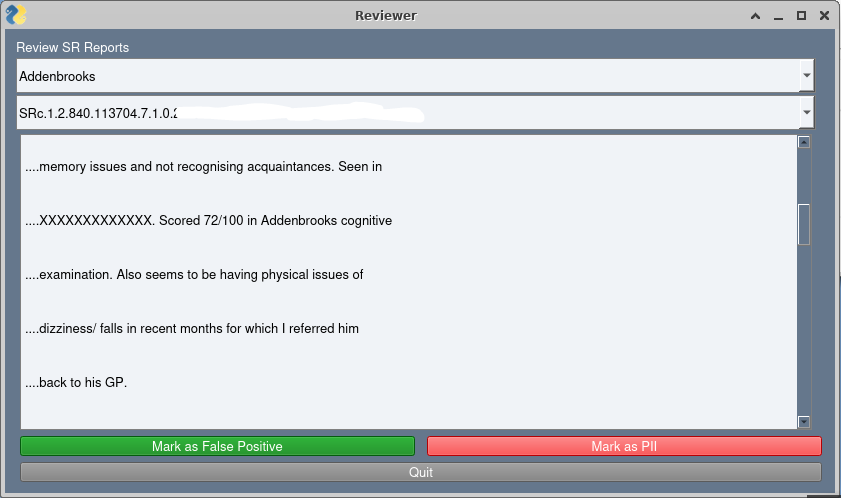

# review_SR_report.py

A simple program to load a report created by the CohortPackager
which contains a list of instances of PII found in DICOM files.

It allows a word or phrase to be chosen and displays a list of files
which contained that text.

Each file can be viewed and marked as a False Positive or as PII.

Upon exit the lists are written to files.

